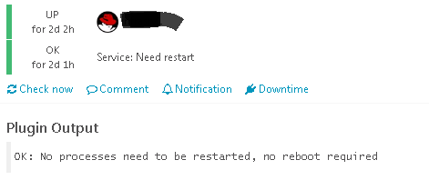
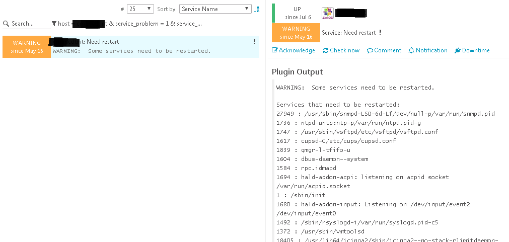

# check_ndrestart
System/services restart need check plugin for Nagios/Icinga

## Description
Nagios plugin (script) to if the system needs to be restarted or if some processes/services need to be restarted following some package updates.

## Installation
Some sudo settings need to be configured. Add a file /etc/sudoers.d/check_ndrestart containing:
```
Defaults:icinga   !requiretty
icinga ALL=(root) NOPASSWD: /usr/bin/needs-restarting
```

## Usage
./check_ndrestart.sh

## Examples
```
[root@xxxxxx custom_plugins]# time ./check_ndrestart.sh
OK: No processes need to be restarted, no reboot required

real    0m4.972s
user    0m3.959s
sys     0m0.895s
[root@xxxxxx custom_plugins]#
```


```
[root@xxxxxx custom_plugins]# time ./check_ndrestart.sh
WARNING:  Some services need to be restarted.|
Services that need to be restarted:
27949 : /usr/sbin/snmpd-LS0-6d-Lf/dev/null-p/var/run/snmpd.pid
1736 : ntpd-untp:ntp-p/var/run/ntpd.pid-g
1747 : /usr/sbin/vsftpd/etc/vsftpd/vsftpd.conf
1617 : cupsd-C/etc/cups/cupsd.conf
1839 : qmgr-l-tfifo-u
1604 : dbus-daemon--system
1584 : rpc.idmapd
1694 : hald-addon-acpi: listening on acpid socket /var/run/acpid.socket
1 : /sbin/init
1680 : hald-addon-input: Listening on /dev/input/event2 /dev/input/event0
1492 : /sbin/rsyslogd-i/var/run/syslogd.pid-c5
1372 : /usr/sbin/vmtoolsd
18405 : /usr/lib64/icinga2/sbin/icinga2--no-stack-rlimitdaemon-c/etc/icinga2/icinga2.conf-d-e/var/log/icinga2/error.log--reload-internal4408
1720 : /usr/sbin/sshd
1652 : hald-runner
1467 : auditd
1651 : hald
1823 : /usr/libexec/postfix/master
18504 : /usr/lib64/icinga2/sbin/icinga2--no-stack-rlimitdaemon-c/etc/icinga2/icinga2.conf-d-e/var/log/icinga2/error.log--reload-internal4408

real    0m1.281s
user    0m0.832s
sys     0m0.303s
[root@xxxxxx custom_plugins]#
```

## Screenshots
1. OK example:



2. WARNING example:


